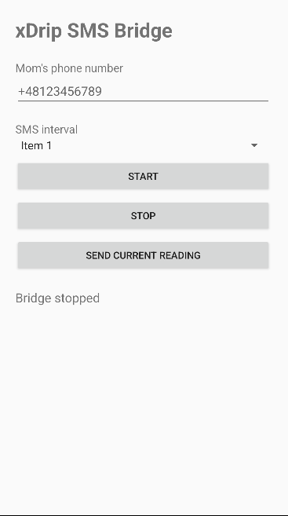

# ⚠️ Known Issue ⚠️
Auto sending doesnt work im trying to figure out why that is happening but it has something with android blocking sms sent by apps even with permissions

# xDrip SMS Bridge

A small Android app that reads the current glucose value from **xDrip+'s local HTTP API** and sends it to another phone via SMS.

Designed for situations where the receiving phone is too old to comfortably run xDrip+, WhatsApp, Messenger, etc.


## Installation

The easiest way to install the app is to download `app-debug.apk` from the project's releases/files and open it directly on the **sending phone**.

Android may ask for permission to install apps from the source you used to download the APK. If prompted, allow the installation and open the APK again.

> **No app icon yet? Don't panic.**
> The current build does not have a custom application icon, so Android may display a generic/default icon. Nothing went wrong with the installation.

After installation:

1. Open **xDrip SMS Bridge**.
2. Grant the requested permissions.
3. Enter the phone number that should receive the glucose readings.
4. Select the desired SMS interval.
5. Press **SEND CURRENT READING** to test the setup.
6. If the test SMS arrives correctly, press **START** to enable automatic sending.

### Android / ADB installation

For developers or users who prefer ADB:

```bash
adb install -r app-debug.apk
```

## Example SMS

The bridge sends a deliberately simple SMS format so it remains readable on older phones and does not depend on emoji support.

### Flat

```text
142 mg/dL
- (?1.2)
```

### Rising

```text
156 mg/dL
^ (?2.4)
```

### Falling

```text
128 mg/dL
V (?−3.1)
```

The format is:

```text
<glucose> mg/dL
<direction> (?<delta>)
```

Direction symbols:

| Symbol | Meaning |
| ------ | ------- |
| `^`    | Rising  |
| `-`    | Flat    |
| `V`    | Falling |

The glucose value is taken directly from xDrip+'s `sgv` value. **No mmol/L conversion is performed.**


## How it works

```text
Libre sensor
     ↓
  Juggluco
     ↓
   xDrip+
     ↓
127.0.0.1:17580/sgv.json
     ↓
xDrip SMS Bridge
     ↓
   SMS
     ↓
Receiving phone
```
